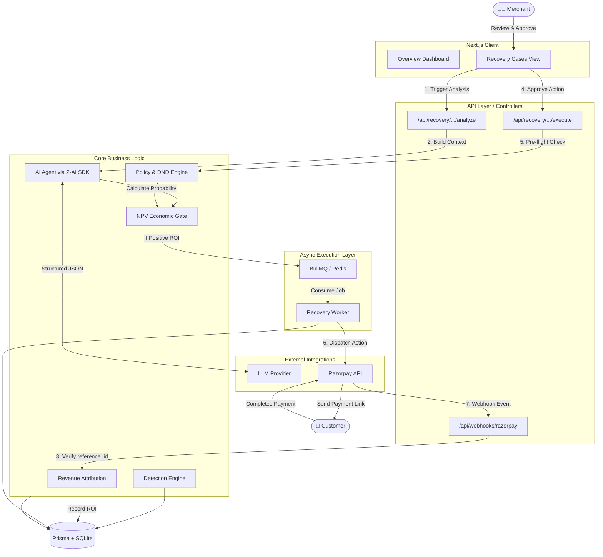
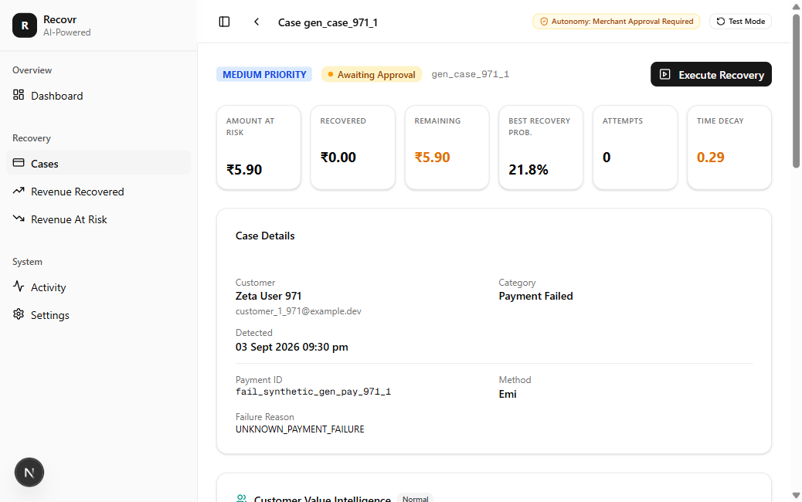
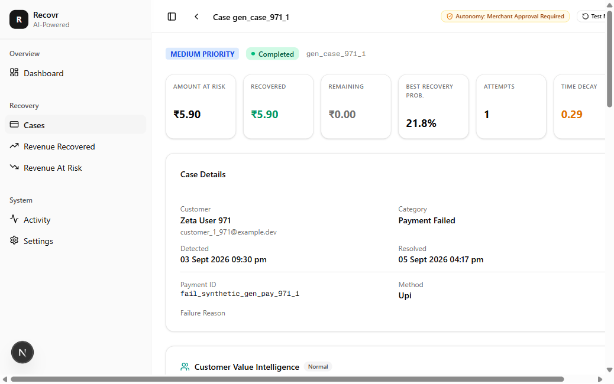

# AI Revenue Recovery

Built for the **Razorpay Buildathon — Track 03**.

> **Evaluation Results (Example, Seed 42)**: Our evaluation harness proves our **AI Economic Gate recovers +₹26,495.34 more Net Value** than a naive retry strategy across a 50-case batch. (Note: Running `bun run generate:demo --seed X` followed by `bun run evaluate` will generate a fresh dataset and yield a mathematically distinct positive net value).

## 1. Problem & Solution

Merchants lose 5–15% of revenue to failed payments, abandoned checkouts, and lapsed subscriptions. Manual recovery is labor-intensive, inconsistent, and unscalable. Existing rule engines blindly retry payments or spam customers without analyzing the cost of the intervention versus the probability of success.

Our solution is an AI-assisted revenue recovery system that detects at-risk revenue, recommends recovery actions via LLM analysis, enforces **deterministic economic and policy guardrails** on every recommendation, and attributes recovered revenue purely from verified payment events (cleanly separating Confirmed vs Unconfirmed revenue).

## 2. Why AI? (The NPV Economic Gate)

Razorpay's existing agents retry based on static rules. Our AI agent dynamically calculates the **Net Present Value (NPV)** of an intervention:

```
Expected Value = (Probability of Success × Amount at Risk) - Cost of Intervention
```

The AI doesn't just guess what to do; it declines to act if the expected incremental recovery is mathematically negative. This guarantees that recovery efforts are strictly profitable, which static rule engines cannot do.

## 3. Core Workflow

```
  Razorpay Events              Detection Engine             AI Agent
  (webhooks / ingest)
  ───────────────►  detect risk signals  ─────────────►  analyze case
  failed payments                    │                   & recommend
  abandoned checkouts                 │                       │
  lapsed subscriptions                │                       ▼
                                      │                 Policy Guardrails
                                      │                 (deterministic)
                                      │                       │
                                      │              ┌────────┴────────┐
                                      │              ▼                 ▼
                                      │         Approved?          Blocked
                                      │              │            (no_action)
                                      ▼              ▼
                              Merchant Approval
                              (financial actions
                               only)
                                      │
                                      ▼
                              Executor Layer
                              (BullMQ / sync)
                                      │
                                      ▼
                              Payment Webhook
                              (payment.captured)
                                      │
                                      ▼
                            Revenue Attribution
                            (verified events only)
```

State flow: `detected → diagnosing → diagnosed → awaiting_approval → executing → completed`

## 4. Proof of Impact (Evaluation Harness)

The repository includes a deterministic evaluation harness (`bun run evaluate`) that measures the AI Economic Gate against a naive retry baseline. The metrics strictly separate deterministic `reference_id` links (Confirmed) from probabilistic heuristics (Unconfirmed).

```text
=== RESULTS ===

┌──────────────────┬───────┬─────────┬───────────┬─────────────────────────┬───────────────────────────┬─────────┬─────────────────────────┬───────────────┬─────────────────────┐
│                  │ Cases │ Actions │ No Action │ Recovered ₹ (Confirmed) │ Recovered ₹ (Unconfirmed) │ Costs ₹ │ Net Value ₹ (Confirmed) │ Recovery Rate │ Unnecessary Actions │
├──────────────────┼───────┼─────────┼───────────┼─────────────────────────┼───────────────────────────┼─────────┼─────────────────────────┼───────────────┼─────────────────────┤
│        NO_ACTION │ 100   │ 0       │ 100       │ 0.00                    │ 29796.18                  │ 0.00    │ 0.00                    │ 13.0%         │ 0                   │
│            NAIVE │ 100   │ 100     │ 0         │ 8205.08                 │ 8662.27                   │ 176.50  │ 8028.58                 │ 38.0%         │ 13                  │
│ AI_ECONOMIC_GATE │ 100   │ 97      │ 3         │ 3474.41                 │ 9978.49                   │ 149.00  │ 3325.41                 │ 37.0%         │ 13                  │
└──────────────────┴───────┴─────────┴───────────┴─────────────────────────┴───────────────────────────┴─────────┴─────────────────────────┴───────────────┴─────────────────────┘

=== KEY FINDINGS ===
Actions avoided by AI Economic Gate: 3
WINNER BY NET VALUE: NAIVE (+₹4703.17 over AI_ECONOMIC_GATE)

Note: The evaluation harness measures simulated strategy performance on controlled datasets.
It does not by itself establish causal real-world incremental revenue.
```

## 5. Tech Stack

| Layer | Technology |
|-------|-----------|
| Framework | Next.js 16, React 19, TypeScript 5 |
| Styling | Tailwind CSS 4, shadcn/ui |
| Data | Prisma ORM, SQLite |
| Queue | BullMQ, ioredis (optional — sync fallback) |
| AI | z-ai-web-dev-sdk (structured output, deterministic fallback) |
| Payments | Razorpay SDK (test/dev mode) |
| State | TanStack Query, Zustand |
| Runtime | Bun |

## 6. Architecture & Data Flow

Recovr implements an event-driven, microservices-inspired architecture designed to safely bridge probabilistic AI and deterministic financial ledgers.



### Codebase Structure

```
src/
├── app/api/              # Next.js API routes (Controllers)
├── services/
│   ├── recovery/         # Detection, Agent Logic, and Attribution
│   ├── execution/        # Approval gate, BullMQ workers, and executors
│   ├── webhook/          # Razorpay event ingestion & normalization
│   └── ai/               # z-ai-web-dev-sdk wrapper for strict schemas
├── lib/
│   ├── db.ts             # Prisma client singleton
│   ├── money.ts          # Safe currency math (Int64, no floats)
│   └── state-machine.ts  # Centralized case status transitions
└── worker/               # Standalone BullMQ background process
```

## 7. AI Safety Model

The AI is **bounded** and **cannot execute actions**:

- **Output schema enforced** — the LLM must return a structured `AIDecisionOutput` (action, confidence, reason, factors, risk level). Zod validates every response.
- **Bounded action set** — only 7 allowed actions: `no_action`, `retry_payment`, `send_reminder`, `update_payment_method`, `escalate_to_merchant`, `payment_link`, `offer_discount`. The model cannot invent new actions.
- **Policy guardrails run after AI** — deterministic rules check confidence thresholds, amount limits, attempt counts, and cooldowns. Policy can override the AI recommendation (e.g., downgrade `offer_discount` to `send_reminder`).
- **No PII in prompts** — customer context is sanitized to display name and payment statistics only.
- **Deterministic fallback** — if the AI provider is unavailable or returns invalid output, a rule-based fallback produces a safe recommendation.

## 8. Revenue Attribution

`recoveredAmount` on a case is **only updated from verified payment events**, never from executor results.

Attribution signals (by confidence):

| Source | Confidence | Mechanism |
|--------|-----------|-----------|
| `payment_retry` | 0.95 | Same payment externalId captured after retry |
| `payment_link` | 1.00 | Deterministic match via `reference_id` or `notes.recovery_case_id` on the webhook |
| `manual` | 1.00 | Merchant manually attributed |
| `temporal` | 0.40 | Probabilistic fallback (customer + amount heuristic) — marked `temporal` for review and excluded from headline metrics |

Attribution is deterministic via `reference_id`/`notes` when the payment flows through a recovery-generated link. A lower-confidence fallback exists for payments made outside that flow, which is explicitly labeled and excluded from headline confirmed metrics.

## 9. Failure Modes & Recovery Behavior

The system classifies execution failures to ensure operational transparency and financial safety. These categories are surfaced in the merchant UI in a human-readable format.

| Failure | System Behavior | Financial Safety | Retry/Recovery |
|---------|-----------------|------------------|----------------|
| **AI Service Unavailable** | `AI_FAILURE` classified. | No action taken. | Worker automatically queues for safe retry. |
| **Worker Failure / Redis Down** | `QUEUE_FAILURE` classified. | No action taken. | Retries via BullMQ backoff. |
| **Payment Provider Failure** | `PROVIDER_FAILURE` classified. | `PAYMENT_STATE_UNKNOWN` (money movement uncertain). | Worker automatically retries safely. |
| **Delayed Webhook** | `RECONCILIATION_DELAY` handled via DB idempotency. | Processed once, state transitions protected. | Ignored if already processed. |
| **Duplicate Webhook** | `DUPLICATE_EVENT` trapped by DB constraint. | No double-counting of recovered revenue. | Discarded safely. |
| **Stale Decision** | `STALE_DECISION` classified (e.g., already recovered). | Safe abort. | No retry. |
| **DND/Consent Block** | `CUSTOMER_CONTACT_BLOCKED` via Policy Engine. | No contact made. No money moved. | No retry. |
| **Contact Frequency Block** | `POLICY_BLOCK` via Policy Engine. | No action taken. | Will retry when cooling period expires. |
| **Stopping Rule Block** | `POLICY_BLOCK` (e.g. limit reached). | No action taken. | No retry. |

### What Broke and How We Fixed It

Our initial attribution logic fell back to customer+amount matching more often than intended, which we didn't catch until we audited it against our own documented design. We fixed it by switching to a deterministic `reference_id` on payment links and downgrading the heuristic fallback's confidence to `0.40` so it can't silently inflate recovered-revenue numbers. Evaluator metrics now clearly isolate Confirmed vs Unconfirmed revenue.

## 10. Local Setup

```bash
# 1. Install dependencies
bun install

# 2. Configure environment
cp .env.example .env
# Edit .env — see Environment Variables section below

# 3. Initialize database
bun run db:generate
bun run db:push
bun run db:seed

# 4. Start dev server
bun run dev
# App runs at http://localhost:3000

# 5. (Optional) Start BullMQ worker
# Required for async execution. Without it, actions run synchronously.
bun run worker
```

## 11. Environment Variables

See [`.env.example`](.env.example) for a complete template.

| Variable | Required | Description |
|----------|----------|-------------|
| `DATABASE_URL` | Yes | SQLite path, e.g. `file:./db/custom.db` |
| `RAZORPAY_KEY_ID` | No | Razorpay test mode key ID |
| `RAZORPAY_KEY_SECRET` | No | Razorpay test mode key secret |
| `RAZORPAY_WEBHOOK_SECRET` | No | Webhook signature verification secret |
| `AI_PROVIDER` | No | `zai` (default), `openai`, or `anthropic` |
| `OPENAI_API_KEY` | No | Required if `AI_PROVIDER=openai` |
| `ANTHROPIC_API_KEY` | No | Required if `AI_PROVIDER=anthropic` |
| `REDIS_URL` | No | Redis connection URL. Defaults to `redis://localhost:6379` |

The app functions without Razorpay keys (dev mode simulates payments) and without Redis (actions execute synchronously).

## 12. Demo Flow

1. **Seed** the database — creates sample failed payments, abandoned checkouts, and lapsed subscriptions.
2. **Run detection** (`POST /api/recovery/detect`) — the detection engine scores and prioritizes risk signals, creating recovery cases.
3. **Analyze** a case (`POST /api/recovery/cases/[id]/analyze`) — the AI agent recommends an action; policy guardrails validate it.
4. **Review** the decision on the dashboard — approve or reject. Financial actions (`retry_payment`, `payment_link`, `offer_discount`) require explicit merchant approval.
5. **Execute** the approved action (`POST /api/recovery/cases/[id]/execute`) — queued via BullMQ or run synchronously.


*After clicking Execute Recovery, the backend validates deterministic gate rules, queues the recovery attempt, and exposes a Simulate Customer Payment button for testing.*

6. **Simulate a payment webhook** (`POST /api/webhooks/simulate`) — a `payment.captured` event triggers attribution.
7. **Verify** on the dashboard — recovered revenue appears only after attribution from the verified webhook event.


*The webhook simulator triggers the backend attribution engine, successfully matching the payment, completing the case, and recording the recovered ₹5.90 to the dashboard metrics.*

## 13. Demo: Economic Decisioning

The agent evaluates the expected incremental value of recovery interventions against their expected cost. When the economics do not justify intervention, the system intentionally chooses `NO_ACTION`. 

- **Deterministic Backend Gate**: This is powered by a real, deterministic backend economic-gating engine, not a hardcoded UI mockup.
- **AI Recommendation vs Economic Gate**: The AI explains and recommends actions, but it *cannot* override the deterministic economic gate. If an action is economically negative, it is blocked at the backend.
- **Model Estimates**: Values like probability and cost are model estimates; actual recovered revenue is measured separately.
- **Synthetic Data**: The demo uses safe synthetic data. To trigger this Wow Moment:
  1. Go to the Overview Dashboard.
  2. Click **"Run Demo: Do Not Act"** to see a case where the cost of intervention exceeds the expected incremental recovery (Result: `DO_NOT_ACT`).
  3. Click **"Run Demo: Act"** to see a case where a strong incremental upside justifies the intervention cost (Result: `ACT`).

## 14. Key API Endpoints

| Method | Endpoint | Description |
|--------|----------|-------------|
| `POST` | `/api/recovery/detect` | Run detection engine on current data |
| `GET` | `/api/recovery/cases` | List recovery cases (filterable) |
| `GET` | `/api/recovery/cases/[id]` | Get case detail with attempts & decisions |
| `POST` | `/api/recovery/cases/[id]/analyze` | Run AI agent on a case |
| `POST` | `/api/recovery/cases/[id]/execute` | Execute approved recovery action |
| `POST` | `/api/recovery/cases/[id]/stop` | Stop active case |
| `POST` | `/api/recovery/decisions/[id]/approve` | Approve a pending decision |
| `POST` | `/api/recovery/decisions/[id]/reject` | Reject a pending decision |
| `GET` | `/api/recovery/metrics` | Recovery metrics & KPIs |
| `GET` | `/api/recovery/attributions` | Attribution history |
| `POST` | `/api/webhooks/razorpay` | Razorpay webhook endpoint |
| `POST` | `/api/webhooks/simulate` | Simulate a payment event |
| `GET` | `/api/audit` | Full audit trail |
| `GET` | `/api/health` | Service health check |

## 15. Known Limitations

- **No authentication** — the dashboard and API have no auth layer. Not suitable for production exposure.
- **SQLite only** — no PostgreSQL/MySQL support. Not horizontally scalable.
- **No real-time updates** — dashboard polls via TanStack Query. No WebSocket push.
- **Dev-mode Razorpay** — without live keys, payment operations are simulated. Recovery actions produce mock results.
- **No multi-tenant isolation** — single merchant instance. No merchant-scoped data boundaries.
- **In-memory rate limiting** — resets on process restart. Not suitable for distributed deployments.
- **Temporal attribution is weak** — time-proximity-only matches are flagged `unattributed` for manual review, not auto-counted as recovery.
- **No scheduled detection** — detection must be triggered manually or via external cron. There is no built-in scheduler.

## 16. Testing

The project is built natively for Bun. Running tests is as simple as executing:

```bash
bun test
```
